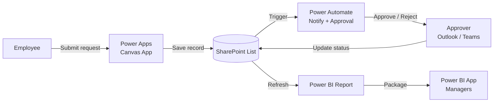

# Digital Productivity with Power BI, Power Automate, Power Apps & SharePoint

> A two-day, hands-on Microsoft Power Platform programme for **PC MTBE**: from manual processes to connected, low-code digital solutions.


> [!IMPORTANT]
> All names, departments, dates and requests in this repository are **fictional training data**. They do not represent actual PC MTBE information, staff or performance.

---

## Table of Contents

- [About the Programme](#about-the-programme)
- [Case Study](#case-study-pc-mtbe-process-improvement-request)
- [Learning Outcomes](#learning-outcomes)
- [Repository Contents](#repository-contents)
- [Prerequisites](#prerequisites)
- [Two-Day Agenda](#two-day-agenda)
- [Hands-On Exercises](#hands-on-exercises)
- [Data Structure](#data-structure)
- [Key Formulas and Expressions](#key-formulas-and-expressions)
- [Expected Results](#expected-results)
- [Power BI App vs Power Apps](#power-bi-app-vs-power-apps)
- [Troubleshooting](#troubleshooting)
- [Trainer](#trainer)
- [License](#license)

---

## About the Programme

This programme helps managers, executives, non-executives and interns automate manual processes, improve reporting, build simple low-code solutions and strengthen collaboration. Participants need **no prior experience** with Power Platform or SharePoint. The programme starts with foundational concepts and then moves through guided demonstrations and hands-on exercises.

| Item | Detail |
|---|---|
| Format | Instructor-led, hands-on |
| Duration | 2 days (about 14 contact hours) |
| Audience | Managers, executives, non-executives, interns |
| Level | Beginner |
| Tools | SharePoint, Power Apps, Power Automate, Power BI |

---

## Case Study: PC MTBE Process Improvement Request

Participants build **one connected solution** across both days. Employees submit ideas for improving work processes, and each request flows automatically from submission to approval to analysis.



**Core principle:** data is entered once, then reused automatically by every platform.

| Stage | Platform | Outcome |
|---|---|---|
| Store | SharePoint | A typed list with 12 fictional records and filtered views |
| Capture | Power Apps | A 3-screen Canvas App with defaults and validation |
| Automate | Power Automate | Auto Request ID, notifications, approval routing, daily reminders |
| Analyse | Power BI | A report on volume, status, priority and monthly trends |
| Share | Power BI App | Related reports packaged for managers in one place |

---

## Learning Outcomes

By the end of the programme, participants will be able to:

1. Explain how SharePoint, Power Apps, Power Automate and Power BI work together to digitalise a process.
2. Organise documents in SharePoint, use version history, and build a SharePoint List with suitable column types.
3. Build a Canvas App that views, submits and updates records, with simple validation.
4. Create flows for notifications, a basic approval and a scheduled reminder, and test them using run history.
5. Connect Power BI to a SharePoint List, prepare the data, and build a clear report.
6. Describe how reports are published and packaged into a Power BI App, including licensing considerations.
7. Identify one manual process in their own work that could be improved using these tools.

---

## Repository Contents

```text
.
├── README.md                                     # This file
├── manual/
│   └── PC_MTBE_Power_Platform_Participant_Manual.docx   # 35-page participant manual
├── slides/
│   └── PC_MTBE_Training_Slides.pptx              # 59-slide trainer deck with speaker notes
├── data/
│   └── PCMTBE_Training_Dataset.xlsx              # Fictional dataset, choice values, expected results
└── powerbi/
    └── PCMTBE_PowerBI_Theme.json                 # Olive and terracotta report theme
```

| File | Used in | Purpose |
|---|---|---|
| Participant manual | All sections | Concepts, numbered procedures, exercises, glossary, review questions |
| Training slides | All sections | Trainer delivery with speaker notes and timing hints |
| Training dataset | Exercises 2.2 and 5.2 | Sample records to paste into the list; formula-driven expected results |
| Power BI theme | Exercise 5.2 | Consistent course colours via **View > Themes > Browse for themes** |

---

## Prerequisites

### For participants

- [ ] Microsoft 365 work account with access to SharePoint
- [ ] Access to [make.powerapps.com](https://make.powerapps.com) and [make.powerautomate.com](https://make.powerautomate.com)
- [ ] [Power BI Desktop](https://www.microsoft.com/power-platform/products/power-bi/desktop) installed (Windows)
- [ ] **Edit** or **Owner** permission on the training SharePoint site
- [ ] Laptop with a modern browser (Microsoft Edge or Google Chrome)

### For administrators

> [!NOTE]
> Some features depend on licensing, permissions and tenant configuration. Confirm these before the programme.

| Requirement | Needed for |
|---|---|
| Training SharePoint site with Edit/Owner access | Exercises 2.1 and 2.2 |
| Power Platform environment for training | Exercises 3.x and 4.x |
| Standard connectors allowed by DLP policy (SharePoint, Office 365 Outlook, Approvals) | Exercises 4.1 to 4.3 |
| Power BI Pro or Premium Per User licence, or Premium/Fabric capacity | Exercise 5.3 (publishing and the Power BI App) |
| Permission to create workspaces and apps | Exercise 5.3 |

If publishing licences are not available, run Exercise 5.3 as a trainer demonstration.

---

## Two-Day Agenda

### Day 1: Foundations, SharePoint and Power Apps

| Time | Session |
|---|---|
| 8:30 – 9:00 | Registration, welcome and objectives |
| 9:00 – 10:00 | Section 1: How the four platforms work together |
| 10:00 – 10:15 | *Morning break* |
| 10:15 – 11:15 | Section 2: SharePoint sites, libraries, version history, permissions |
| 11:15 – 12:30 | Exercises 2.1 and 2.2: Build the request list and views |
| 12:30 – 1:30 | *Lunch* |
| 1:30 – 2:30 | Section 3: Power Apps concepts and Exercise 3.1 |
| 2:30 – 3:30 | Exercise 3.2: Customise, validate and test |
| 3:30 – 3:45 | *Afternoon break* |
| 3:45 – 4:45 | Exercise 3.2 continued; peer testing |
| 4:45 – 5:00 | Day 1 recap |

### Day 2: Power Automate, Power BI and Integration

| Time | Session |
|---|---|
| 9:00 – 9:15 | Recap and warm-up quiz |
| 9:15 – 10:15 | Section 4: Triggers, actions, conditions; Exercise 4.1 |
| 10:15 – 10:30 | *Morning break* |
| 10:30 – 11:45 | Exercises 4.2 and 4.3: Approval and scheduled reminder |
| 11:45 – 12:30 | Section 5: Power BI concepts; Exercise 5.1 |
| 12:30 – 1:30 | *Lunch* |
| 1:30 – 3:00 | Exercise 5.2: Build the Request Monitoring report |
| 3:00 – 3:15 | *Afternoon break* |
| 3:15 – 3:45 | Exercise 5.3: Publishing and the Power BI App |
| 3:45 – 4:30 | Section 6: Integrated end-to-end exercise |
| 4:30 – 5:00 | Review, action planning and closing |

---

## Hands-On Exercises

| # | Exercise | Platform | Duration |
|---|---|---|---|
| 2.1 | Create the Process Improvement Requests list | SharePoint | 25 min |
| 2.2 | Add fictional data and create views | SharePoint | 20 min |
| 3.1 | Generate a Canvas App from the list | Power Apps | 20 min |
| 3.2 | Customise, validate and test the app | Power Apps | 60 min |
| 4.1 | New-request notification and Request ID | Power Automate | 25 min |
| 4.2 | Basic approval workflow | Power Automate | 35 min |
| 4.3 | Scheduled reminder for pending approvals | Power Automate | 25 min |
| 5.1 | Connect to and prepare the data | Power BI | 30 min |
| 5.2 | Build the Request Monitoring report | Power BI | 60 min |
| 5.3 | Publish and package a Power BI App | Power BI | 25 min |
| 6.1 | End-to-end test of the full solution | All | 40 min |

Each exercise in the manual includes an objective, duration, prerequisites, numbered steps, expected result, checkpoint and common errors.

---

## Data Structure

SharePoint List: **Process Improvement Requests**

| Column | Type | Settings / Choices |
|---|---|---|
| Request Title | Single line of text | Built-in Title column, renamed; required |
| Request ID | Single line of text | Filled by Power Automate (`REQ-0001` format) |
| Submission Date | Date and time | Date only; default = today |
| Department | Choice | Operations, Maintenance, Finance, Human Resources, Procurement, HSE, IT |
| Request Type | Choice | Process Automation, Reporting Improvement, Document Management, Digital Form, Other |
| Description | Multiple lines of text | Plain text |
| Priority | Choice | Low, Medium, High |
| Status | Choice | Submitted *(default)*, Pending Approval, Approved, Rejected, In Progress, Completed |
| Owner | Single line of text | Text in training because sample owners are fictional |
| Completion Date | Date and time | Date only; optional |

> [!TIP]
> In a production solution, make **Owner** a **Person** column linked to your directory.

---

## Key Formulas and Expressions

<details>
<summary><b>Power Apps (Power Fx)</b></summary>

**Gallery: newest requests first, with search**
```powerfx
SortByColumns(
    Filter(
        'Process Improvement Requests',
        StartsWith(Title, TextSearchBox1.Text)
    ),
    "ID",
    SortOrder.Descending
)
```

**Status label colour**
```powerfx
Switch(
    ThisItem.Status.Value,
    "Completed", RGBA(74, 90, 43, 1),
    "Rejected", RGBA(181, 84, 58, 1),
    "Pending Approval", RGBA(191, 128, 20, 1),
    RGBA(46, 46, 46, 1)
)
```

**Status card default for new requests**
```powerfx
If(EditForm1.Mode = FormMode.New, {Value: "Submitted"}, ThisItem.Status)
```

**Save button with validation**
```powerfx
If(
    IsBlank(txtTitle.Text) || IsEmpty(cmbPriority.SelectedItems)
        || Len(txtDescription.Text) < 20,
    Notify("Please enter a title, choose a priority and write a description of at least 20 characters.", NotificationType.Error),
    SubmitForm(EditForm1)
)
```
</details>

<details>
<summary><b>Power Automate (expressions)</b></summary>

**Generate Request ID**
```text
concat('REQ-', formatNumber(triggerOutputs()?['body/ID'], '0000'))
```

**Get items Filter Query: pending approvals**
```text
Status eq 'Pending Approval'
```

**Condition: older than three days**
```text
addDays(utcNow(), -3, 'yyyy-MM-dd')
```
</details>

<details>
<summary><b>Power BI (DAX measures)</b></summary>

```dax
Total Requests = COUNTROWS(Requests)

Completed Requests =
    CALCULATE([Total Requests], Requests[Status] = "Completed")

Open Requests =
    CALCULATE([Total Requests],
        NOT Requests[Status] IN {"Completed", "Rejected"})

Completion Rate = DIVIDE([Completed Requests], [Total Requests])

Avg Days to Complete =
    AVERAGEX(
        FILTER(Requests, NOT ISBLANK(Requests[Completion Date])),
        DATEDIFF(Requests[Submission Date], Requests[Completion Date], DAY)
    )
```
</details>

---

## Expected Results

These figures are based on the 12 fictional records, before participants add their own requests.

| Measure | Expected value |
|---|---|
| Total Requests | 12 |
| Completed Requests | 4 |
| Open Requests | 7 |
| Completion Rate | 33.3% |
| Avg Days to Complete | 28.0 |

| Status | Count |
|---|---|
| Submitted | 2 |
| Pending Approval | 2 |
| Approved | 1 |
| Rejected | 1 |
| In Progress | 2 |
| Completed | 4 |

The **Summary** sheet in `PCMTBE_Training_Dataset.xlsx` recalculates these automatically when rows are added.

---

## Power BI App vs Power Apps

| Aspect | Power BI App | Power Apps |
|---|---|---|
| Purpose | Packages and distributes Power BI reports and dashboards | Builds business applications that capture and update data |
| Built in | Power BI Service, from a workspace (**Create app**) | Power Apps Studio (make.powerapps.com) |
| Users | View, filter and explore reports | Enter, edit and submit information |
| In this case | *PC MTBE Improvement Insights* for managers | *Request App* for staff |

---

## Troubleshooting

| Platform | Problem | Quick fix |
|---|---|---|
| SharePoint | Cannot create a list | Request Edit/Owner permission from the site owner |
| SharePoint | Pasted values rejected | Match choice values exactly; check date format |
| Power Apps | New column missing from form | Refresh the data source, then add via **Edit fields** |
| Power Apps | "Name isn't valid" error | Match control names in the Tree view exactly |
| Power Apps | Users see old version | **Publish** the app; users reopen it |
| Power Automate | Flow does not trigger | Confirm the flow is On and the site/list are correct |
| Power Automate | Condition goes to wrong branch | Use exactly `Approve` (case-sensitive) |
| Power BI | Cannot connect to list | Use the **site** URL; sign in with Microsoft account |
| Power BI | Choice columns show "Record" | Expand the column and select **Value** |
| Power BI | Cannot publish or create app | Licence, workspace role or tenant setting missing; check with your administrator |

---

## Trainer

**Fakhrul Syahmi**
Data Consultant & HRD Corp Certified Trainer (TTT/8389)
Mufasyah Consultant

- Master of Data Science, Universiti Kebangsaan Malaysia (UKM)
- Microsoft Certified: Azure AI Fundamentals (AI-900), Azure Data Fundamentals (DP-900), Power Platform Fundamentals (PL-900)

📧 mufasyahcons@gmail.com

---

## License

© 2026 Fakhrul Syahmi. All rights reserved.

These materials are provided for participants of this programme. Reproduction or redistribution outside the programme requires written permission from the trainer.

*Microsoft, SharePoint, Power Apps, Power Automate and Power BI are trademarks of the Microsoft group of companies.*
